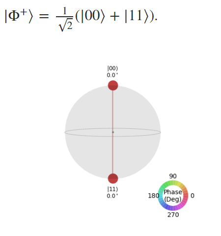
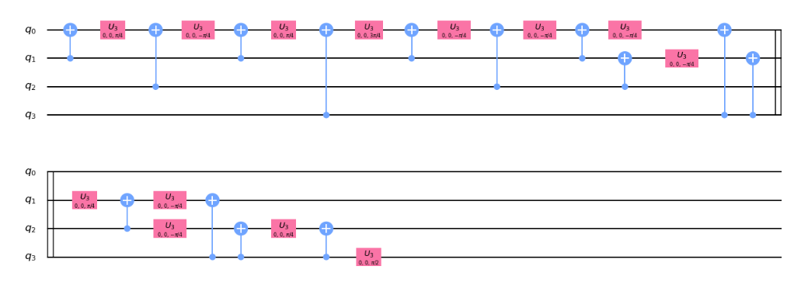
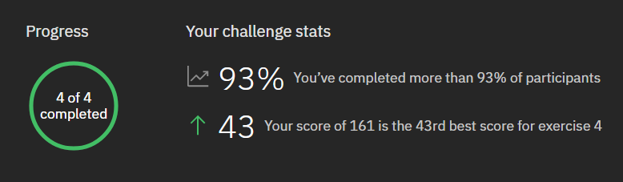

# From LinkedIn post

Stayed up until 7am to finish the last exercise of the IBM Quantum Challenge. 

Through this challenge, I learned about qubits and different types of Quantum Gates. Using Qiskit, a Python library for Quantum Computing, I got the chance to build quantum circuits from basic Pauli and Hadamard gates. I could even run the circuits on an actual IBM Quantum server, getting the measurements of a real quantum computer.

I am also exposed to some applications of quantum computing, such as the BB84 quantum cryptography protocol for private key distribution. 

There are many challenges for quantum computing ahead. Reducing measurement noise and implementing efficient quantum circuits are just a few. But I believe quantum computing will become the next big thing and gain mass adoption within 20 years' time. #

Meanwhile, thank you IBM for democratizing quantum computing and preparing us for the next wave of innovation.

Pictures below are my attempts at decomposing a quantum circuits into U3 and CNOT gates. Never imagine my Linear Algebra knowledge from school become so crucial in solving this problem.

